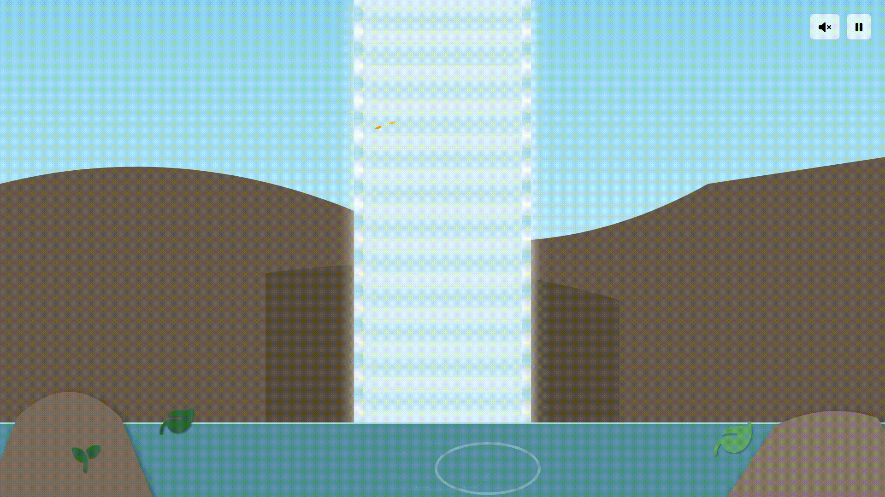

# Cena de Cachoeira Digital

Este projeto é uma demonstração visual interativa que cria uma cena de cachoeira viva e relaxante usando tecnologias web modernas. O objetivo é combinar animações, efeitos de partículas e som ambiente para construir uma experiência imersiva diretamente no navegador.

## Gif

*Acima está um exemplo.*

## Funcionalidades

* **Cachoeira Dinâmica**: A água flui continuamente, com múltiplos fluxos para dar uma aparência mais natural.
* **Névoa Realista**: Partículas de névoa sobem da base da cachoeira, criando um efeito de spray de água.
* **Ambiente Vivo**: A cena inclui plantas que balançam suavemente e uma borboleta que voa com um padrão de movimento natural.
* **Som Ambiente**: Um som de cachoeira em loop pode ser ativado para aumentar a imersão.
* **Controles Interativos**: O usuário pode ligar/desligar o som e pausar/continuar todas as animações da cena a qualquer momento.

## Como Funciona

A cena é construída em camadas para criar uma sensação de profundidade, com elementos de fundo, um plano principal e elementos de primeiro plano.

1. **Estrutura e Camadas (HTML + CSS)**: O HTML organiza todos os elementos da cena (céu, montanhas, rochas, água, plantas). O CSS é usado para estilizar esses elementos, posicioná-los em camadas (z-index) e criar as animações mais simples, como o fluxo da água e o balanço das plantas.

2. **Animações Avançadas (GSAP)**: Para o voo complexo e não-linear da borboleta, foi utilizada a biblioteca **GSAP (GreenSock Animation Platform)**. Ela permite criar sequências de animação sofisticadas que seriam difíceis de alcançar apenas com CSS.

3. **Efeitos de Partículas (tsParticles)**: A névoa na base da cachoeira não é uma imagem ou um vídeo. Ela é gerada em tempo real pela biblioteca **tsParticles**, que cria centenas de pequenas partículas individuais e as anima para simular um spray de água.

4. **Interatividade (JavaScript)**: O JavaScript atua como o cérebro do projeto. Ele inicializa todas as bibliotecas, gerencia o estado da cena (pausado ou tocando) e escuta os cliques do usuário nos botões de controle para executar as ações correspondentes, como tocar o som ou pausar as animações do GSAP e do CSS.

## Tecnologias Utilizadas

* **HTML5**: Para a estrutura semântica da cena.
* **CSS3**: Para estilização, layout, e animações de base (@keyframes).
* **JavaScript**: Para a lógica de interatividade e manipulação do DOM.
* **GSAP**: Biblioteca de animação para o movimento complexo da borboleta.
* **tsParticles**: Biblioteca para a criação do efeito de névoa com partículas.
* **Bootstrap 5**: Para a estilização rápida dos botões de controle e suas dicas de ajuda (tooltips).
* **Font Awesome**: Para os ícones usados nos botões e em algumas plantas.

## Créditos

Desenvolvido por Mateus S.  
GitHub: [Matz-Turing](https://github.com/Matz-Turing)
